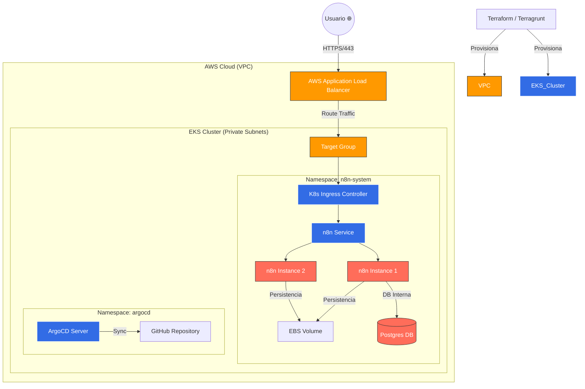

# 🚀 AWS EKS Enterprise n8n Platform (GitOps Edition)


Desplegaremos un ecosistema n8n escalable y seguro en AWS bajo estándares de producciónUna aplicando una arquitectura de referencia completa con AWS Elastic Kubernetes Service (EKS), utilizando **Terraform/Terragrunt** para la infraestructura como código (IaC) y **ArgoCD** para el despliegue continuo (GitOps) y gobernanza financiera (FinOps) suite de auditoría forense para costo $0.00.

---

## 🏗️ Arquitectura

El sistema está diseñado para ser resiliente, escalable y seguro. Todo el tráfico es gestionado por un AWS Application Load Balancer (ALB) que enruta las peticiones al cluster EKS privado.



## ✨ Características Clave

* **IaC Completo:** Infraestructura modular (VPC, EKS, IAM) definida con Terraform y Terragrunt.
* **GitOps Nativo:** ArgoCD sincroniza automáticamente el estado del cluster con el repositorio, permitiendo "App of Apps".
* **Networking Avanzado:** Integración nativa con AWS ALB Controller para Ingress.
* **FinOps Ready:** Incluye scripts de destrucción forense ("Nuke Protocol") para garantizar costo $0 tras las pruebas.
* **Seguridad IAM:** Uso de *IAM Roles for Service Accounts* (IRSA) para gestión de permisos sin credenciales estáticas.

## Cómo se conectan las piezas:

* **iac/** (El Cimiento): Terragrunt se usa para modularizar AWS. Aquí es donde naces con la red (VPC) y el músculo (EKS). Es el enfoque "Infrastructure First".

* **gitops/** (El Cerebro): La separación en apps, infra y manifests sigue el estándar de ArgoCD. Permite que el clúster se "auto-gestione" leyendo los cambios en Git.

* **scripts/** (El Control): Es la capa de seguridad y eficiencia. Aquí reside la capacidad de hacer un "Nuke" "Destrucción Total" controlada y certificar de no dejas rastro de costos.

---

## 🚀 Despliegue Rápido (Quick Start)

Para una guía detallada paso a paso, consulta el [RUNBOOK.md](./RUNBOOK.md).

### 1. Prerrequisitos
* AWS CLI configurado (`aws configure`).
* Terraform, Terragrunt, Kubectl y Helm instalados.

### 2. Infraestructura (Terraform)
Preparar el backend remoto y desplegar la red y el cluster:

```bash
./scripts/setup_backend.sh          # S3 + DynamoDB para tfstate
cd iac/live/vpc && terragrunt apply # Crea VPC
cd ../eks && terragrunt apply       # Crea EKS Cluster
```

### 3. Plataforma (Kubernetes)
Instalar controladores y desplegar n8n mediante GitOps:

```bash
# Instalar AWS Load Balancer Controller (Gestión de Tráfico)
./scripts/setup_alb_controller.sh

# Instalar ArgoCD y Desplegar n8n
kubectl create namespace argocd
kubectl apply -n argocd -f [https://raw.githubusercontent.com/argoproj/argo-cd/stable/manifests/install.yaml](https://raw.githubusercontent.com/argoproj/argo-cd/stable/manifests/install.yaml)
kubectl apply -f gitops/apps/n8n-app.yaml
```

---

## 🧹 Limpieza Forense (Destrucción)

⚠️ **IMPORTANTE:** Para evitar costos en AWS, utiliza los scripts de limpieza en el orden correcto. Estos scripts eliminan dependencias circulares y recursos huérfanos.

```bash
# 1. Destrucción total de Infraestructura y Apps
./scripts/forensic_nuke_v9_omnipotent.sh

# 2. (Opcional) Si la VPC persiste por bloqueo de dependencias
./scripts/forensic_nuke_v10_vpc_terminator.sh

# 3. Auditoría Final (Verificar costo $0)
./scripts/audit_finops_ultimate.sh

# 4. Eliminar Backend de Terraform (S3/DynamoDB)
./scripts/nuke_backend_smart.sh
```

---
**Desarrollado con ❤️ por Jose Garagorry**
